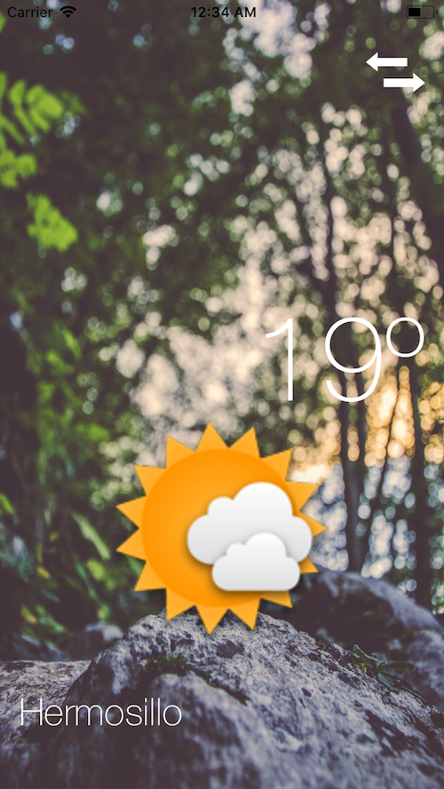

# Clima
> iOS app to display the weather by city name or  gps user location.

The purpose of this project is to show the basic functions of the following topics.

- Schemes (Change your API endpoint/environment using Xcode Configurations)
- Alamofire and SwiftyJSON for Http Requests
- Unit Test
- MVC structure

**Note: Do not forget to change the [OpenWeatherMap](http://openweathermap.org/api) key (OWM_API_KEY) from User-Defined settings by your own key**

Iphone 8             |  Iphone X
:-------------------------:|:-------------------------:
  | 
 | 
 | 

## Requirements

- iOS 8.0+
- Xcode 9
- Swift 4
- Cocoapods 1.3.+

## Meta

Jonathan Guillermo – hernandezmarquina@gmail.com

Distributed under the MIT license.

[Github - hernandezmarquina](https://github.com/hernandezmarquina)